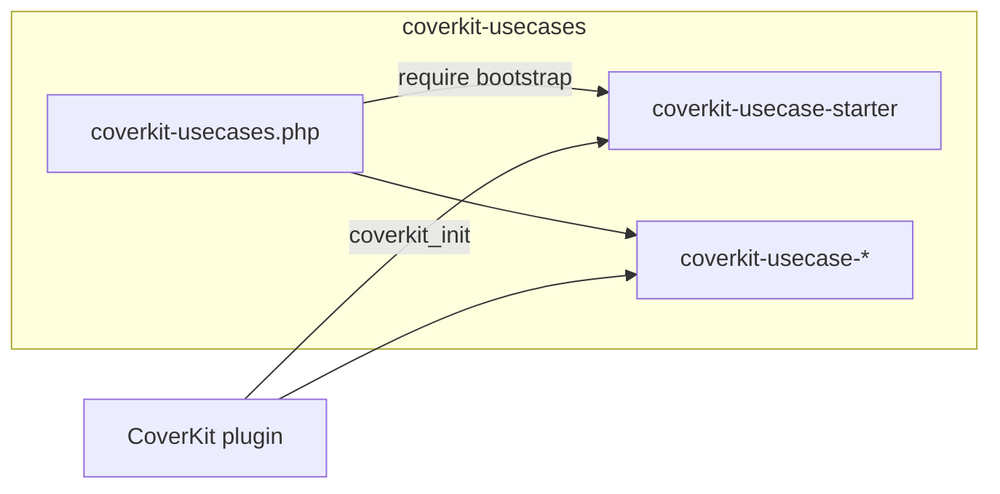
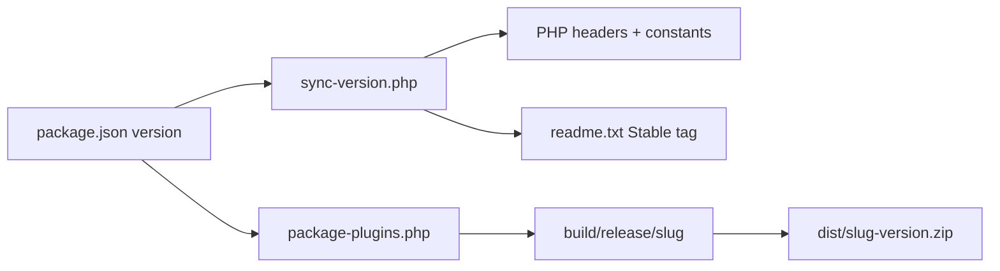

# Architecture

How the CoverKit use cases monorepo is organized.

## Components

| Piece | Role |
| --- | --- |
| **`coverkit-usecases.php`** | Monorepo loader; `glob()` + `require_once` for each `plugins/coverkit-usecase-*` bootstrap |
| **`plugins/coverkit-usecase-<slug>/`** | One WordPress plugin = one registered use case |
| **CoverKit** | Provides `coverkit_register_use_case()`, `Use_Case` base class, editor UI |

## Monorepo vs standalone

| Context | Install | Activate |
| --- | --- | --- |
| **Development** | Clone repo to `wp-content/plugins/coverkit-usecases` | **CoverKit Use Cases** (root) |
| **Single use case** | Release zip → `wp-content/plugins/coverkit-usecase-<slug>/` | That use case plugin (+ CoverKit) |

WordPress only scans top-level `wp-content/plugins/` — nested `plugins/` folders are invisible to core. The root loader bridges that in dev; release zips are top-level plugins.

## Plugin headers

Every use case bootstrap must be a valid WordPress plugin file with at least:

- `Plugin Name`
- `Version`
- `Requires Plugins: coverkit`
- `Text Domain`

CI enforces this via `PluginHeaderTest`.

## Registration lifecycle

1. Bootstrap loads (via monorepo loader or standalone activation).
2. Bootstrap hooks `coverkit_init` (priority 5) and calls `coverkit_register_use_case( $slug, $args )`.
3. CoverKit registry boots registered types at priority 10.

Defer `require_once` of subclass files until the `coverkit_init` callback. `Requires Plugins: coverkit` ensures CoverKit is active before the hook runs.

## Label-only vs subclass

- **Label only** — omit `class` in registration args; CoverKit uses base `Use_Case` defaults.
- **Subclass** — extend `CoverKit\Use_Case`; override `recommended_settings()`, `use_case_mapping_sources()`, `use_case_settings_schema()`, and optionally `init()` for front-end behavior.

## Release packaging

1. **`sync-version.php`** — copies `package.json` version into the loader, every use case bootstrap, and each `readme.txt`.
2. **`package-plugins.php`** — for each `plugins/coverkit-usecase-*`:
   - optional `npm run build` when the plugin has `package.json`
   - stage production files only (excludes `src/`, `node_modules/`, tests, dev config)
   - zip with **folder root** `<slug>/` so WordPress can install from **Plugins → Add New → Upload**

CI runs `composer run package:release` on tag push; assets attach to the GitHub Release. The monorepo loader is **not** zipped — releases target standalone per-use-case installs.

## Further reading

- [Create a use case](create-a-use-case.md)
- CoverKit [custom use case user guide](https://docs.coverkit.com/user-guide/use-cases/custom-use-case/)
- [Agent skills](agents.md)
